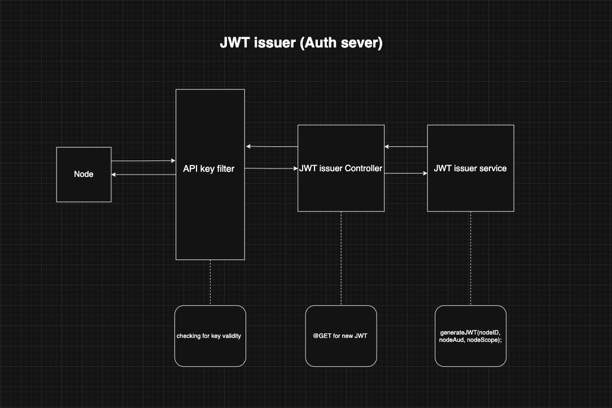
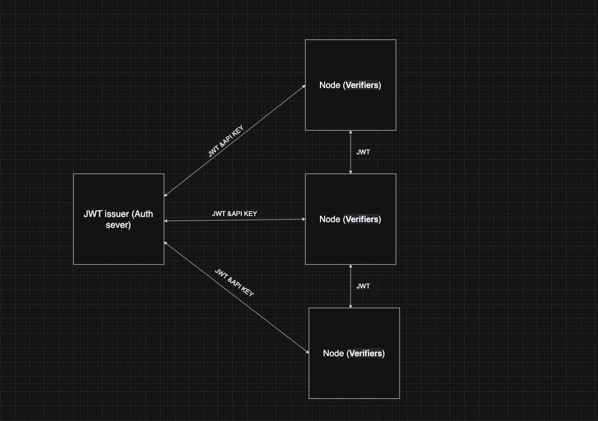

# DistroAuth

DistroAuth is a Spring Boot-based authentication microservice designed for distributed systems. It provides secure, scalable, and stateless authentication using JWT (JSON Web Tokens) and API keys, making it suitable for microservices architectures, cloud-native applications, and any environment where decentralized authentication is required.

## Use Case in Distributed Systems

In distributed systems, managing authentication across multiple services can be challenging. DistroAuth centralizes authentication logic, allowing services to delegate authentication and authorization tasks. This approach:

- **Decouples authentication from business logic** in each microservice.
- **Enables stateless authentication** using JWTs, reducing session management complexity.
- **Supports API key-based access** for providing the JWT that enables the service to be authenticated.
- **Improves security** by centralizing JWT tokens management and authentication policies.
- **Scales easily** as new services can integrate with distroAuth without duplicating logic in service code.

## Features

- JWT-based authentication between services with each others 
- API key authentication for providing JWT token to be included in the distributed servers and services
- Configurable security filters as needed by the user 
- RESTful endpoints for token issuance and validation
- Easily extensible for custom authentication needs

## Project Structure

- `src/main/java/com/ditroauth/distroauth/JWT/` - JWT authentication porviding logic
- `src/main/java/com/ditroauth/distroauth/keyfilter/` - API key authentication and security configuration


## How It Works

1. **A service requests a JWT token** by providing valid credentials (depending on the env config).
2. **DistrioAuth validates credentials** and issues a signed JWT.
3. **Clients use the JWT** to authenticate requests to other services.

The following diagrams provide a visual overview of the service architecture and the system in action:


### Distributed System Authentication Flow


### JWT Issuer Internal Flow



## Endpoints

### 1. `auth/v1/jwt` (GET)
**Description:** Generates a JWT token for valid credentials (API key in this case).
**Request Body:**
```json
{
  "nodeId": "<nodeId>",
  "nodeAudience": "<nodeAudience>",
  "nodeIssuer": "<nodeIssuer>"
}
```
**Response:**
The token will be in the header 'authorization' and their will be a body response such:
```json
{
   "JWT Token generated successfully"
}
```
**Use Case:** Used services to obtain a JWT for subsequent authenticated requests.

## Security Configuration

The project uses Spring Security to configure authentication filters for API keys. You can customize security policies in `SecurityConfig.java`.

## Getting Started

1. **Clone the repository:**
   ```bash
   git clone https://github.com/ABAlosaimi/distroauth.git 
   ```
2. **Build the project:**
   ```bash
   cd distroauth
   ./mvnw clean install
   ```
3. **Run the service:**
   ```bash
   ./mvnw spring-boot:run
   ```
4. **Configure clients** to use the `auth/v1/jwt` endpoint for JWTs and include API keys in requests's header.

## Example Usage

**Requesting a JWT:**
```bash
curl -X GET http://localhost:8080/auth/v1/jwt \
  -H "Content-Type: application/json" \ "authorization": equfkhebliufbe43r834r2389rhrui2b 
     
  -d '{"nodeId": "2138ehed", "nodeAudience": "service A, service B,service C, "nodeIssuer": "node X"}'
```

## Contributing

Contributions are welcome! Please open issues or submit pull requests for improvements or new features or you can raech me at X @ABA_24a.
